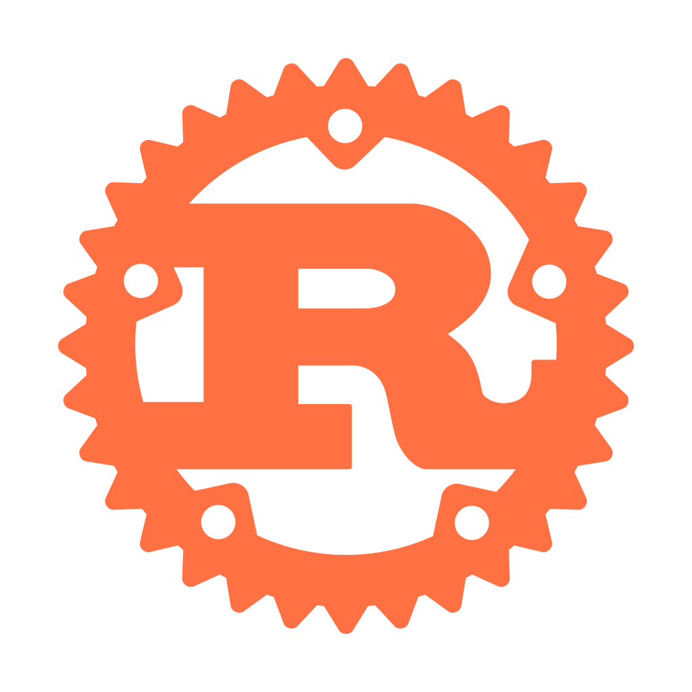
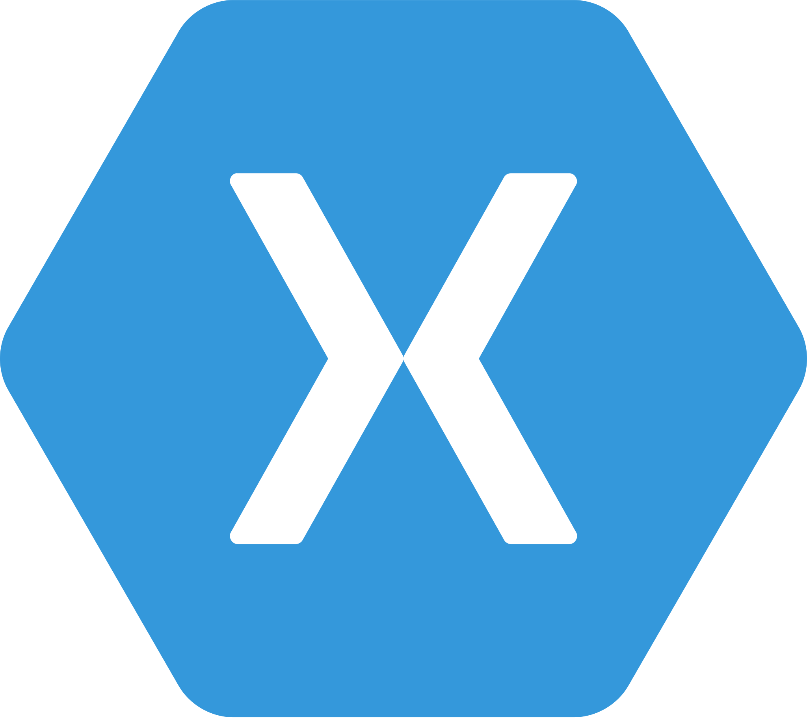
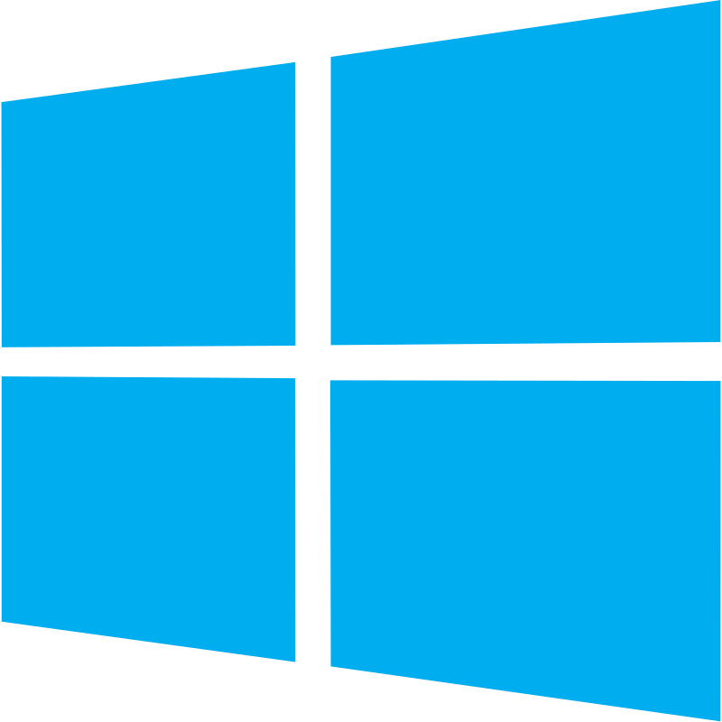

<h1 align="center"> Hi there! I'm Pedro 👋</h1>
<h3 align="center">
Backend Software Engineer passionate about solving complex problems and building scalable solutions.
I work mainly with .NET, focusing on APIs and Clean Architecture, and use Rust to explore low-level concepts and performance.
I seek challenges that allow me to continuously improve my skills and contribute to innovative projects.
</h3>

- 🔭 I’m currently working on [submarine-management-system](https://github.com/phgodoy/submarine-management-system)
- 🌱 I’m currently learning **Clean Architecture, .NET, React**, Rust
- 📫 How to reach me **phgodoy12@gmail.com**
- 🗼 Working every day to achieve my goals!

<h3 align="left">Connect with me:</h3>

  

<h3 align="left">Languages and Tools:</h3>

  <!-- Backend -->
  
  
  
  
  
  
  

  <!-- Branding / Frameworks -->
  
  
  
  

  <!-- Frontend -->
  
  
  
  

  <!-- Databases -->
  
  
  
  

  <!-- DevOps -->
  
  
  
  
  

  <!-- Tools -->
  
  
  

 

 
